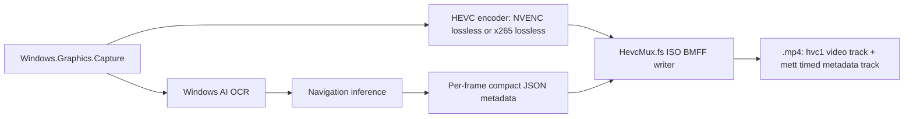

Agent is idle (waiting for messages). agent_id: mux-metadata-1, agent_type: dayour-architect, status: idle, description: MP4/MKV mux + metadata track, elapsed: 416s, total_turns: 2

[Turn 0]
## Architecture Summary

Current-state rating: SOLID with specific container risks.

Recommendation: use Strategy ISOBMFF, a hand-rolled MP4 writer, not Media Foundation SinkWriter.

Rationale: the muxer’s core requirement is not just “write HEVC video”; it is “write externally encoded HEVC plus synchronized per-frame metadata samples in one seekable container.” Media Foundation’s MP4 sink is reasonable for normal encoded video pipelines, but its support for arbitrary timed metadata tracks is underspecified and fragile from raw COM interop. A deterministic ISO BMFF writer gives full control over the `hvc1` video track, `hvcC`, sample tables, shared timescale, and timed metadata track.



## Decision: MF SinkWriter vs Hand-Rolled ISOBMFF

### Media Foundation SinkWriter

Pros:
- Native Windows API.
- Can write MP4 with HEVC when the OS/media stack supports it.
- Avoids maintaining MP4 sample-table code.

Cons:
- HEVC passthrough is fragile. SinkWriter must accept an already encoded `MFVideoFormat_HEVC` input stream; depending on sink and attributes it may expect length-prefixed samples, reject Annex-B, or try to negotiate a transform.
- Timed metadata support through SinkWriter is not consistently documented for generic binary metadata tracks in MP4.
- Raw vtable interop for `IMFSinkWriter`, `IMFMediaType`, `IMFSample`, `IMFMediaBuffer`, and attributes is a lot of COM surface area for uncertain metadata-track behavior.
- If using MKV to simplify arbitrary metadata, downstream support becomes less predictable. MP4 timed metadata is the better target here.

### Hand-Rolled ISOBMFF

Pros:
- Deterministic MP4 output: `ftyp`, `mdat`, `moov`.
- Full control over:
  - `hvc1` video sample entry.
  - `hvcC` from encoder-provided configuration or VPS/SPS/PPS.
  - Per-sample offsets/sizes/timestamps.
  - Second timed metadata track using handler `meta` and sample entry `mett`.
- Clean synchronization model: both tracks use the same 10,000,000 Hz media timescale, matching Windows 100 ns units.
- No FFmpeg, no Media Foundation negotiation ambiguity.

Cons:
- You own MP4 correctness.
- `hvcC` generation from VPS/SPS/PPS is a real risk area. Best result is to pass the encoder’s real HEVC decoder configuration record when available.
- The implementation below writes one chunk per sample, which is simple and robust but not the smallest possible sample table for very long recordings.

Recommendation: Strategy ISOBMFF.

---

## ADR-004: Native ISO BMFF Writer for Lossless HEVC Recorder

## Status: Proposed

## Context

The recorder receives an externally encoded HEVC elementary stream from NVENC lossless or x265 lossless and must mux it with per-frame OCR/navigation metadata. The metadata must be time-aligned with video frames so downstream tools can seek to a frame and retrieve the detected screen text and UI affordances at the same instant.

## Decision

Implement a native F# ISO BMFF/MP4 writer in `HevcMux.fs`. The writer emits:

- `ftyp`
- `mdat`
- trailing `moov`
- one `hvc1` video track with `hvcC`
- one timed metadata track with handler type `meta` and sample entry `mett`
- shared 10,000,000 Hz timescale for movie, video, and metadata tracks
- 64-bit chunk offsets via `co64`

Video samples are stored as MP4-compatible length-prefixed HEVC NAL units. Annex-B input is converted at write time.

## Consequences

- Avoids Media Foundation SinkWriter ambiguity around passthrough HEVC and generic timed metadata tracks.
- Keeps the implementation native and deterministic.
- Requires careful validation with downstream MP4 parsers.
- Requires the encoder to provide accurate `hvcC`, or at least VPS/SPS/PPS NAL units so the writer can build a decoder configuration record.

## Alternatives Considered

- Media Foundation SinkWriter with MP4 sink: rejected because generic synchronized metadata track behavior is too uncertain and raw COM interop cost is high.
- MKV/WebM-style container: rejected because MP4 timed metadata is better specified for this requirement and downstream enterprise tooling is more likely to understand MP4.

---

# Complete `HevcMux.fs`

```fsharp
namespace Yumlog.Native

open System
open System.Buffers.Binary
open System.Collections.Generic
open System.IO
open System.Runtime.InteropServices
open System.Text
open System.Text.Json
open System.Text.Json.Serialization

module HevcMux =

    [<Literal>]
    let private MediaTimescale = 10_000_000L

    [<DllImport("kernel32.dll", SetLastError = true)>]
    extern bool QueryPerformanceFrequency(int64& frequency)

    type MetadataOcrWord =
        { t: string
          c: float
          b: TextBounds }

    type MetadataOcrLine =
        { t: string
          c: float
          b: TextBounds
          w: MetadataOcrWord array }

    type MetadataHint =
        { k: string
          l: string
          c: float
          b: TextBounds }

    type FrameMetadata =
        { qpc: int64
          frame: int
          ocr: MetadataOcrLine array
          hints: MetadataHint array }

    let private jsonOptions =
        JsonSerializerOptions(
            PropertyNamingPolicy = JsonNamingPolicy.CamelCase,
            DefaultIgnoreCondition = JsonIgnoreCondition.WhenWritingNull)

    let private emptyBounds =
        { TopLeft = { X = 0.0; Y = 0.0 }
          TopRight = { X = 0.0; Y = 0.0 }
          BottomRight = { X = 0.0; Y = 0.0 }
          BottomLeft = { X = 0.0; Y = 0.0 } }

    let private pointsOfBounds (b: TextBounds) =
        [| b.TopLeft; b.TopRight; b.BottomRight; b.BottomLeft |]

    let private boundsFromWords (words: OcrWord array) =
        if Array.isEmpty words then
            emptyBounds
        else
            let points =
                words
                |> Array.collect (fun word -> pointsOfBounds word.BoundingBox)

            let minX = points |> Array.map _.X |> Array.min
            let maxX = points |> Array.map _.X |> Array.max
            let minY = points |> Array.map _.Y |> Array.min
            let maxY = points |> Array.map _.Y |> Array.max

            { TopLeft = { X = minX; Y = minY }
              TopRight = { X = maxX; Y = minY }
              BottomRight = { X = maxX; Y = maxY }
              BottomLeft = { X = minX; Y = maxY } }

    let metadataPayloadJson
        (frameIndex: int)
        (qpc: int64)
        (ocr: OcrResult option)
        (hints: UiNavigationHint array option)
        : byte array =

        let ocrLines =
            match ocr with
            | None -> Array.empty
            | Some result ->
                result.Lines
                |> Array.map (fun line ->
                    let words =
                        line.Words
                        |> Array.map (fun word ->
                            { t = word.Text
                              c = word.Confidence
                              b = word.BoundingBox })

                    let confidence =
                        if Array.isEmpty line.Words then
                            0.0
                        else
                            line.Words |> Array.averageBy _.Confidence

                    { t = line.Text
                      c = confidence
                      b = boundsFromWords line.Words
                      w = words })

        let hintDtos =
            hints
            |> Option.defaultValue Array.empty
            |> Array.map (fun hint ->
                { k = hint.Kind
                  l = hint.Label
                  c = hint.Confidence
                  b = hint.Bounds })

        let payload =
            { qpc = qpc
              frame = frameIndex
              ocr = ocrLines
              hints = hintDtos }

        JsonSerializer.SerializeToUtf8Bytes(payload, jsonOptions)

    type private BeWriter(stream: Stream) =

        member _.WriteUInt8(value: byte) =
            stream.WriteByte(value)

        member _.WriteZero(count: int) =
            if count > 0 then
                let bytes = Array.zeroCreate<byte> count
                stream.Write(bytes, 0, bytes.Length)

        member _.WriteBytes(bytes: byte array) =
            stream.Write(bytes, 0, bytes.Length)

        member _.WriteAscii(value: string) =
            let bytes = Encoding.ASCII.GetBytes(value)
            stream.Write(bytes, 0, bytes.Length)

        member _.WriteUtf8Z(value: string) =
            let bytes = Encoding.UTF8.GetBytes(value)
            stream.Write(bytes, 0, bytes.Length)
            stream.WriteByte(0uy)

        member _.WriteUInt16(value: uint16) =
            let bytes = Array.zeroCreate<byte> 2
            BinaryPrimitives.WriteUInt16BigEndian(Span<byte>(bytes), value)
            stream.Write(bytes, 0, bytes.Length)

        member _.WriteInt16(value: int16) =
            let bytes = Array.zeroCreate<byte> 2
            BinaryPrimitives.WriteInt16BigEndian(Span<byte>(bytes), value)
            stream.Write(bytes, 0, bytes.Length)

        member _.WriteUInt24(value: uint32) =
            stream.WriteByte(byte ((value >>> 16) &&& 0xFFu))
            stream.WriteByte(byte ((value >>> 8) &&& 0xFFu))
            stream.WriteByte(byte (value &&& 0xFFu))

        member _.WriteUInt32(value: uint32) =
            let bytes = Array.zeroCreate<byte> 4
            BinaryPrimitives.WriteUInt32BigEndian(Span<byte>(bytes), value)
            stream.Write(bytes, 0, bytes.Length)

        member _.WriteInt32(value: int32) =
            let bytes = Array.zeroCreate<byte> 4
            BinaryPrimitives.WriteInt32BigEndian(Span<byte>(bytes), value)
            stream.Write(bytes, 0, bytes.Length)

        member _.WriteUInt64(value: uint64) =
            let bytes = Array.zeroCreate<byte> 8
            BinaryPrimitives.WriteUInt64BigEndian(Span<byte>(bytes), value)
            stream.Write(bytes, 0, bytes.Length)

        member _.WriteInt64(value: int64) =
            let bytes = Array.zeroCreate<byte> 8
            BinaryPrimitives.WriteInt64BigEndian(Span<byte>(bytes), value)
            stream.Write(bytes, 0, bytes.Length)

        member _.WriteFixed16_16(value: int) =
            _.WriteUInt32(uint32 value <<< 16)

    let private makeBox (name: string) (writeBody: BeWriter -> unit) =
        use ms = new MemoryStream()
        let writer = BeWriter(ms)

        writer.WriteUInt32(0u)
        writer.WriteAscii(name)
        writeBody writer

        if ms.Length > int64 UInt32.MaxValue then
            failwithf "Box %s is too large for a 32-bit MP4 box size." name

        ms.Position <- 0L
        writer.WriteUInt32(uint32 ms.Length)
        ms.ToArray()

    let private makeFullBox (name: string) (version: byte) (flags: uint32) (writeBody: BeWriter -> unit) =
        makeBox name (fun writer ->
            writer.WriteUInt8(version)
            writer.WriteUInt24(flags)
            writeBody writer)

    let private startCodeLength (bytes: byte array) (offset: int) =
        if offset + 3 <= bytes.Length
           && bytes[offset] = 0uy
           && bytes[offset + 1] = 0uy
           && bytes[offset + 2] = 1uy then
            3
        elif offset + 4 <= bytes.Length
             && bytes[offset] = 0uy
             && bytes[offset + 1] = 0uy
             && bytes[offset + 2] = 0uy
             && bytes[offset + 3] = 1uy then
            4
        else
            0

    let private hasAnnexBStartCode (bytes: byte array) =
        bytes.Length >= 3 && startCodeLength bytes 0 <> 0

    let private findStartCode (bytes: byte array) (fromOffset: int) =
        let mutable found = -1
        let mutable i = fromOffset

        while found < 0 && i <= bytes.Length - 3 do
            if startCodeLength bytes i <> 0 then
                found <- i
            else
                i <- i + 1

        found

    let private splitAnnexB (bytes: byte array) =
        let nals = ResizeArray<byte array>()
        let mutable start = findStartCode bytes 0

        while start >= 0 do
            let scLen = startCodeLength bytes start
            let nalStart = start + scLen
            let next = findStartCode bytes nalStart
            let nalEnd = if next >= 0 then next else bytes.Length

            let mutable trimmedEnd = nalEnd
            while trimmedEnd > nalStart && bytes[trimmedEnd - 1] = 0uy do
                trimmedEnd <- trimmedEnd - 1

            if trimmedEnd > nalStart then
                let nal = Array.zeroCreate<byte> (trimmedEnd - nalStart)
                Buffer.BlockCopy(bytes, nalStart, nal, 0, nal.Length)
                nals.Add(nal)

            start <- next

        nals.ToArray()

    let private trySplitLengthPrefixed (bytes: byte array) =
        let nals = ResizeArray<byte array>()
        let mutable offset = 0
        let mutable ok = bytes.Length >= 4

        while ok && offset < bytes.Length do
            if offset + 4 > bytes.Length then
                ok <- false
            else
                let length =
                    BinaryPrimitives.ReadUInt32BigEndian(ReadOnlySpan<byte>(bytes, offset, 4))
                    |> int

                if length <= 0 || offset + 4 + length > bytes.Length then
                    ok <- false
                else
                    let nal = Array.zeroCreate<byte> length
                    Buffer.BlockCopy(bytes, offset + 4, nal, 0, length)
                    nals.Add(nal)
                    offset <- offset + 4 + length

        if ok && offset = bytes.Length && nals.Count > 0 then
            Some(nals.ToArray())
        else
            None

    let private splitNalUnits (bytes: byte array) =
        if Array.isEmpty bytes then
            Array.empty
        elif hasAnnexBStartCode bytes then
            splitAnnexB bytes
        else
            match trySplitLengthPrefixed bytes with
            | Some nals -> nals
            | None -> [| bytes |]

    let private nalUnitType (nal: byte array) =
        if nal.Length < 2 then
            -1
        else
            int ((nal[0] >>> 1) &&& 0x3Fuy)

    let private normalizeHevcSampleForMp4 (bytes: byte array) =
        let nals = splitNalUnits bytes

        use ms = new MemoryStream()
        let writer = BeWriter(ms)

        for nal in nals do
            if nal.Length > 0 then
                writer.WriteUInt32(uint32 nal.Length)
                writer.WriteBytes(nal)

        ms.ToArray()

    let private looksLikeHvcc (bytes: byte array) =
        bytes.Length >= 23
        && bytes[0] = 1uy
        && not (hasAnnexBStartCode bytes)

    let private buildHvccFromVpsSpsPps (firstNals: byte array) =
        let nals = splitNalUnits firstNals

        let byType t =
            nals
            |> Array.filter (fun nal -> nalUnitType nal = t)

        let vps = byType 32
        let sps = byType 33
        let pps = byType 34

        if Array.isEmpty vps || Array.isEmpty sps || Array.isEmpty pps then
            failwith "HEVC hvcC generation requires VPS, SPS, and PPS NAL units. Pass encoder hvcC or first NALs containing VPS/SPS/PPS."

        let firstSps = sps[0]

        let profileTierLevelByte =
            if firstSps.Length > 3 then firstSps[3] else 1uy

        let profileCompatibility =
            if firstSps.Length > 7 then
                firstSps[4..7]
            else
                [| 0uy; 0uy; 0uy; 0uy |]

        let constraintFlags =
            if firstSps.Length > 13 then
                firstSps[8..13]
            else
                Array.zeroCreate<byte> 6

        let levelIdc =
            if firstSps.Length > 14 then firstSps[14] else 120uy

        let numTemporalLayers =
            if firstSps.Length > 2 then
                int ((firstSps[2] >>> 1) &&& 0x07uy) + 1
            else
                1

        let temporalIdNested =
            if firstSps.Length > 2 && (firstSps[2] &&& 0x01uy) <> 0uy then
                1
            else
                0

        use ms = new MemoryStream()
        let writer = BeWriter(ms)

        writer.WriteUInt8(1uy)                         // configurationVersion
        writer.WriteUInt8(profileTierLevelByte)        // profile_space, tier_flag, profile_idc
        writer.WriteBytes(profileCompatibility)        // profile_compatibility_flags
        writer.WriteBytes(constraintFlags)             // constraint_indicator_flags
        writer.WriteUInt8(levelIdc)                    // level_idc

        writer.WriteUInt16(0xF000us)                  // min_spatial_segmentation_idc unknown
        writer.WriteUInt8(0xFCuy)                     // parallelismType unknown
        writer.WriteUInt8(0xFCuy ||| 1uy)             // chromaFormat: conservative 4:2:0 default
        writer.WriteUInt8(0xF8uy)                     // bitDepthLumaMinus8: 8-bit default
        writer.WriteUInt8(0xF8uy)                     // bitDepthChromaMinus8: 8-bit default
        writer.WriteUInt16(0us)                       // avgFrameRate

        let packed =
            byte (((0 &&& 0x03) <<< 6)
                  ||| ((numTemporalLayers &&& 0x07) <<< 3)
                  ||| ((temporalIdNested &&& 0x01) <<< 2)
                  ||| 3)

        writer.WriteUInt8(packed)                     // constantFrameRate, numTemporalLayers, temporalIdNested, lengthSizeMinusOne
        writer.WriteUInt8(3uy)                        // arrays: VPS, SPS, PPS

        let writeArray nalType (items: byte array array) =
            writer.WriteUInt8(0x80uy ||| byte nalType) // array_completeness + NAL_unit_type
            writer.WriteUInt16(uint16 items.Length)

            for nal in items do
                writer.WriteUInt16(uint16 nal.Length)
                writer.WriteBytes(nal)

        writeArray 32 vps
        writeArray 33 sps
        writeArray 34 pps

        ms.ToArray()

    type private Sample =
        { Offset: uint64
          Size: uint32
          Time: int64
          Duration: uint32 }

    type private TrackKind =
        | Video
        | Metadata

    let private duration100nsFromFps fps =
        if fps <= 0 then
            invalidArg (nameof fps) "fps must be positive."

        int64 (Math.Round(float MediaTimescale / float fps))

    let private clampDurationToUInt32 (value: int64) =
        if value <= 0L then
            1u
        elif value > int64 UInt32.MaxValue then
            UInt32.MaxValue
        else
            uint32 value

    let private samplesWithDurations (defaultDuration: int64) (samples: ResizeArray<Sample>) =
        let arr = samples.ToArray()

        [| for i in 0 .. arr.Length - 1 do
               let duration =
                   if i + 1 < arr.Length then
                       arr[i + 1].Time - arr[i].Time
                   else
                       defaultDuration

               yield { arr[i] with Duration = clampDurationToUInt32 duration } |]

    let private mediaDuration (samples: Sample array) =
        samples
        |> Array.sumBy (fun sample -> int64 sample.Duration)

    let private firstMediaTime (samples: Sample array) =
        if Array.isEmpty samples then 0L else samples[0].Time

    let private makeFtyp () =
        makeBox "ftyp" (fun writer ->
            writer.WriteAscii("isom")
            writer.WriteUInt32(0x00000200u)
            writer.WriteAscii("isom")
            writer.WriteAscii("iso6")
            writer.WriteAscii("mp41")
            writer.WriteAscii("hvc1"))

    let private makeMvhd (duration: int64) =
        makeFullBox "mvhd" 1uy 0u (fun writer ->
            writer.WriteUInt64(0UL)                         // creation_time
            writer.WriteUInt64(0UL)                         // modification_time
            writer.WriteUInt32(uint32 MediaTimescale)
            writer.WriteUInt64(uint64 duration)
            writer.WriteUInt32(0x00010000u)                 // rate 1.0
            writer.WriteUInt16(0x0100us)                    // volume 1.0
            writer.WriteUInt16(0us)
            writer.WriteUInt32(0u)
            writer.WriteUInt32(0u)

            writer.WriteUInt32(0x00010000u)
            writer.WriteUInt32(0u)
            writer.WriteUInt32(0u)
            writer.WriteUInt32(0u)
            writer.WriteUInt32(0x00010000u)
            writer.WriteUInt32(0u)
            writer.WriteUInt32(0u)
            writer.WriteUInt32(0u)
            writer.WriteUInt32(0x40000000u)

            for _ in 1 .. 6 do
                writer.WriteUInt32(0u)

            writer.WriteUInt32(3u))                         // next_track_ID

    let private makeTkhd trackId duration width height kind =
        makeFullBox "tkhd" 1uy 0x000007u (fun writer ->
            writer.WriteUInt64(0UL)
            writer.WriteUInt64(0UL)
            writer.WriteUInt32(uint32 trackId)
            writer.WriteUInt32(0u)
            writer.WriteUInt64(uint64 duration)
            writer.WriteUInt32(0u)
            writer.WriteUInt32(0u)
            writer.WriteUInt16(0us)                         // layer
            writer.WriteUInt16(0us)                         // alternate_group

            match kind with
            | Video -> writer.WriteUInt16(0us)
            | Metadata -> writer.WriteUInt16(0us)

            writer.WriteUInt16(0us)

            writer.WriteUInt32(0x00010000u)
            writer.WriteUInt32(0u)
            writer.WriteUInt32(0u)
            writer.WriteUInt32(0u)
            writer.WriteUInt32(0x00010000u)
            writer.WriteUInt32(0u)
            writer.WriteUInt32(0u)
            writer.WriteUInt32(0u)
            writer.WriteUInt32(0x40000000u)

            match kind with
            | Video ->
                writer.WriteUInt32(uint32 width <<< 16)
                writer.WriteUInt32(uint32 height <<< 16)
            | Metadata ->
                writer.WriteUInt32(0u)
                writer.WriteUInt32(0u))

    let private makeEdtsIfNeeded (emptyDuration: int64) (trackDuration: int64) =
        if emptyDuration <= 0L then
            Array.empty
        else
            makeBox "edts" (fun writer ->
                writer.WriteBytes(
                    makeFullBox "elst" 1uy 0u (fun elst ->
                        elst.WriteUInt32(2u)

                        elst.WriteUInt64(uint64 emptyDuration)
                        elst.WriteInt64(-1L)
                        elst.WriteInt16(1s)
                        elst.WriteInt16(0s)

                        elst.WriteUInt64(uint64 trackDuration)
                        elst.WriteInt64(0L)
                        elst.WriteInt16(1s)
                        elst.WriteInt16(0s))))
            |> fun box -> [| box |]

    let private makeMdhd duration =
        makeFullBox "mdhd" 1uy 0u (fun writer ->
            writer.WriteUInt64(0UL)
            writer.WriteUInt64(0UL)
            writer.WriteUInt32(uint32 MediaTimescale)
            writer.WriteUInt64(uint64 duration)
            writer.WriteUInt16(0x55C4us)                    // language: und
            writer.WriteUInt16(0us))

    let private makeHdlr handlerType name =
        makeFullBox "hdlr" 0uy 0u (fun writer ->
            writer.WriteUInt32(0u)
            writer.WriteAscii(handlerType)
            writer.WriteUInt32(0u)
            writer.WriteUInt32(0u)
            writer.WriteUInt32(0u)
            writer.WriteUtf8Z(name))

    let private makeDinf () =
        makeBox "dinf" (fun writer ->
            writer.WriteBytes(
                makeFullBox "dref" 0uy 0u (fun dref ->
                    dref.WriteUInt32(1u)
                    dref.WriteBytes(makeFullBox "url " 0uy 1u ignore))))

    let private makeVmhd () =
        makeFullBox "vmhd" 0uy 1u (fun writer ->
            writer.WriteUInt16(0us)
            writer.WriteUInt16(0us)
            writer.WriteUInt16(0us)
            writer.WriteUInt16(0us))

    let private makeNmhd () =
        makeFullBox "nmhd" 0uy 0u ignore

    let private makeHvc1SampleEntry width height hvcc =
        makeBox "hvc1" (fun writer ->
            writer.WriteZero(6)
            writer.WriteUInt16(1us)                         // data_reference_index

            writer.WriteUInt16(0us)
            writer.WriteUInt16(0us)
            writer.WriteUInt32(0u)
            writer.WriteUInt32(0u)
            writer.WriteUInt32(0u)

            writer.WriteUInt16(uint16 width)
            writer.WriteUInt16(uint16 height)
            writer.WriteUInt32(0x00480000u)                 // horizresolution 72 dpi
            writer.WriteUInt32(0x00480000u)                 // vertresolution 72 dpi
            writer.WriteUInt32(0u)
            writer.WriteUInt16(1us)                         // frame_count

            let compressor = Array.zeroCreate<byte> 32
            let name = Encoding.ASCII.GetBytes("Yumlog HEVC")
            let len = min 31 name.Length
            compressor[0] <- byte len
            Buffer.BlockCopy(name, 0, compressor, 1, len)
            writer.WriteBytes(compressor)

            writer.WriteUInt16(0x0018us)                    // depth
            writer.WriteInt16(-1s)

            writer.WriteBytes(makeBox "hvcC" (fun hvccBox -> hvccBox.WriteBytes(hvcc))))

    let private makeMetadataSampleEntry () =
        makeBox "mett" (fun writer ->
            writer.WriteZero(6)
            writer.WriteUInt16(1us)                         // data_reference_index
            writer.WriteUtf8Z("")                           // content_encoding
            writer.WriteUtf8Z("application/vnd.yumlog.frame+json"))

    let private makeStsd kind width height hvcc =
        makeFullBox "stsd" 0uy 0u (fun writer ->
            writer.WriteUInt32(1u)

            match kind with
            | Video ->
                writer.WriteBytes(makeHvc1SampleEntry width height hvcc)
            | Metadata ->
                writer.WriteBytes(makeMetadataSampleEntry()))

    let private makeStts (samples: Sample array) =
        makeFullBox "stts" 0uy 0u (fun writer ->
            if Array.isEmpty samples then
                writer.WriteUInt32(0u)
            else
                let entries = ResizeArray<uint32 * uint32>()

                for sample in samples do
                    if entries.Count = 0 then
                        entries.Add(1u, sample.Duration)
                    else
                        let index = entries.Count - 1
                        let count, duration = entries[index]

                        if duration = sample.Duration then
                            entries[index] <- (count + 1u, duration)
                        else
                            entries.Add(1u, sample.Duration)

                writer.WriteUInt32(uint32 entries.Count)

                for count, duration in entries do
                    writer.WriteUInt32(count)
                    writer.WriteUInt32(duration))

    let private makeStsc (samples: Sample array) =
        makeFullBox "stsc" 0uy 0u (fun writer ->
            if Array.isEmpty samples then
                writer.WriteUInt32(0u)
            else
                writer.WriteUInt32(1u)
                writer.WriteUInt32(1u)                      // first_chunk
                writer.WriteUInt32(1u)                      // samples_per_chunk
                writer.WriteUInt32(1u))                     // sample_description_index

    let private makeStsz (samples: Sample array) =
        makeFullBox "stsz" 0uy 0u (fun writer ->
            writer.WriteUInt32(0u)                          // sample_size: variable
            writer.WriteUInt32(uint32 samples.Length)

            for sample in samples do
                writer.WriteUInt32(sample.Size))

    let private makeCo64 (samples: Sample array) =
        makeFullBox "co64" 0uy 0u (fun writer ->
            writer.WriteUInt32(uint32 samples.Length)

            for sample in samples do
                writer.WriteUInt64(sample.Offset))

    let private makeStbl kind width height hvcc samples =
        makeBox "stbl" (fun writer ->
            writer.WriteBytes(makeStsd kind width height hvcc)
            writer.WriteBytes(makeStts samples)
            writer.WriteBytes(makeStsc samples)
            writer.WriteBytes(makeStsz samples)
            writer.WriteBytes(makeCo64 samples))

    let private makeMinf kind width height hvcc samples =
        makeBox "minf" (fun writer ->
            match kind with
            | Video -> writer.WriteBytes(makeVmhd())
            | Metadata -> writer.WriteBytes(makeNmhd())

            writer.WriteBytes(makeDinf())
            writer.WriteBytes(makeStbl kind width height hvcc samples))

    let private makeMdia kind width height hvcc duration samples =
        let handlerType, handlerName =
            match kind with
            | Video -> "vide", "Yumlog HEVC Video"
            | Metadata -> "meta", "Yumlog Timed Metadata"

        makeBox "mdia" (fun writer ->
            writer.WriteBytes(makeMdhd duration)
            writer.WriteBytes(makeHdlr handlerType handlerName)
            writer.WriteBytes(makeMinf kind width height hvcc samples))

    let private makeTrak trackId kind width height hvcc samples =
        let duration = mediaDuration samples
        let editOffset = firstMediaTime samples

        makeBox "trak" (fun writer ->
            writer.WriteBytes(makeTkhd trackId (duration + editOffset) width height kind)

            for edts in makeEdtsIfNeeded editOffset duration do
                writer.WriteBytes(edts)

            writer.WriteBytes(makeMdia kind width height hvcc duration samples))

    let private makeMoov width height hvcc videoSamples metadataSamples =
        let movieDuration =
            max
                ((mediaDuration videoSamples) + (firstMediaTime videoSamples))
                ((mediaDuration metadataSamples) + (firstMediaTime metadataSamples))

        makeBox "moov" (fun writer ->
            writer.WriteBytes(makeMvhd movieDuration)
            writer.WriteBytes(makeTrak 1 Video width height hvcc videoSamples)
            writer.WriteBytes(makeTrak 2 Metadata 0 0 hvcc metadataSamples))

    type Muxer(path: string, width: int, height: int, fps: int, hvcCOrFirstNals: byte array) =

        let frameDuration = duration100nsFromFps fps

        let qpcFrequency =
            let mutable frequency = 0L

            if not (QueryPerformanceFrequency(&frequency)) || frequency <= 0L then
                failwith "QueryPerformanceFrequency failed."

            frequency

        let hvcc =
            if looksLikeHvcc hvcCOrFirstNals then
                hvcCOrFirstNals
            else
                buildHvccFromVpsSpsPps hvcCOrFirstNals

        let filePath = Path.GetFullPath(path)

        do
            match Path.GetDirectoryName(filePath) with
            | null
            | "" -> ()
            | parent -> Directory.CreateDirectory(parent) |> ignore

        let stream =
            new FileStream(filePath, FileMode.Create, FileAccess.ReadWrite, FileShare.Read)

        let videoSamples = ResizeArray<Sample>()
        let metadataSamples = ResizeArray<Sample>()

        let mutable closed = false
        let mutable firstQpc: int64 option = None

        let mdatStart =
            let ftyp = makeFtyp()
            stream.Write(ftyp, 0, ftyp.Length)

            let start = stream.Position
            let writer = BeWriter(stream)
            writer.WriteUInt32(1u)                         // largesize form
            writer.WriteAscii("mdat")
            writer.WriteUInt64(0UL)                        // patched on close
            start

        member _.Path = filePath

        member private _.MediaTimeFromQpc(qpc: int64) =
            match firstQpc with
            | None ->
                firstQpc <- Some qpc
                0L
            | Some origin ->
                let delta = qpc - origin

                if delta < 0L then
                    invalidArg (nameof qpc) "Samples must not be written with QPC values earlier than the first sample."

                (delta * MediaTimescale) / qpcFrequency

        member private this.WriteSample(target: ResizeArray<Sample>, bytes: byte array, qpc: int64) =
            if closed then
                invalidOp "Cannot write samples after close()."

            if isNull bytes || bytes.Length = 0 then
                invalidArg (nameof bytes) "Sample payload must not be empty."

            let mediaTime = this.MediaTimeFromQpc(qpc)
            let offset = uint64 stream.Position

            stream.Write(bytes, 0, bytes.Length)

            target.Add(
                { Offset = offset
                  Size = uint32 bytes.Length
                  Time = mediaTime
                  Duration = uint32 frameDuration })

        member this.WriteVideoSample(nal: byte array, qpc: int64) =
            let sample = normalizeHevcSampleForMp4 nal
            this.WriteSample(videoSamples, sample, qpc)

        member this.WriteMetadataSample(payload: byte array, qpc: int64) =
            this.WriteSample(metadataSamples, payload, qpc)

        member _.Close() =
            if not closed then
                closed <- true

                let video = samplesWithDurations frameDuration videoSamples
                let metadata = samplesWithDurations frameDuration metadataSamples

                if Array.isEmpty video then
                    invalidOp "Cannot close HEVC muxer without at least one video sample."

                let mdatEnd = stream.Position
                let mdatSize = uint64 (mdatEnd - mdatStart)

                stream.Position <- mdatStart
                let patch = BeWriter(stream)
                patch.WriteUInt32(1u)
                patch.WriteAscii("mdat")
                patch.WriteUInt64(mdatSize)

                stream.Position <- mdatEnd
                let moov = makeMoov width height hvcc video metadata
                stream.Write(moov, 0, moov.Length)

                stream.Flush()
                stream.Dispose()

        interface IDisposable with
            member this.Dispose() =
                this.Close()

    let ``open`` (path: string) (width: int) (height: int) (fps: int) (hvcCOrFirstNals: byte array) =
        new Muxer(path, width, height, fps, hvcCOrFirstNals)

    let writeVideoSample (muxer: Muxer) (nal: byte array) (qpc: int64) =
        muxer.WriteVideoSample(nal, qpc)

    let writeMetadataSample (muxer: Muxer) (payload: byte array) (qpc: int64) =
        muxer.WriteMetadataSample(payload, qpc)

    let close (muxer: Muxer) =
        muxer.Close()
```

## Container-Writing Detail

The implementation emits this MP4 layout:

```text
ftyp
mdat
moov
  mvhd
  trak video track id 1
    tkhd
    mdia
      mdhd
      hdlr handler_type='vide'
      minf
        vmhd
        dinf
          dref
            url 
        stbl
          stsd
            hvc1
              hvcC
          stts
          stsc
          stsz
          co64
  trak metadata track id 2
    tkhd
    mdia
      mdhd
      hdlr handler_type='meta'
      minf
        nmhd
        dinf
          dref
            url 
        stbl
          stsd
            mett
              content_encoding=''
              mime_format='application/vnd.yumlog.frame+json'
          stts
          stsc
          stsz
          co64
```

Video samples:
- Input may be Annex-B, length-prefixed, or a single raw NAL unit.
- The muxer writes MP4-compatible 4-byte length-prefixed NAL units into `mdat`.
- `stsz` records each encoded access unit size.
- `co64` records each access unit byte offset.

Metadata samples:
- The muxer writes the payload bytes exactly as provided.
- The provided helper `metadataPayloadJson` serializes:
  - `qpc`
  - `frame`
  - OCR lines:
    - text
    - aggregate bbox
    - average word confidence
    - word-level text/confidence/bbox
  - navigation hints:
    - kind
    - label
    - confidence
    - bounds

Because MP4 sample boundaries are explicit in `stsz`, the JSON does not need an internal length prefix. If a downstream non-MP4 extractor concatenates samples, add a four-byte length prefix before calling `WriteMetadataSample`.

## QPC Timestamp Mapping and Synchronization

Windows Graphics Capture `SystemRelativeTime` is QPC-based. The muxer maps it into the MP4 media timeline using:

```text
mediaTime100ns = ((sampleQpc - firstQpc) * 10,000,000) / QueryPerformanceFrequency()
```

The movie, video track, and metadata track all use:

```text
timescale = 10,000,000
```

That means one media tick equals one Windows 100 ns tick.

Synchronization rule:

```fsharp
let qpc = frame.SystemRelativeTimeQpc

muxer.WriteVideoSample(encodedHevcAccessUnit, qpc)

let payload =
    HevcMux.metadataPayloadJson frameIndex qpc (Some ocr) (Some hints)

muxer.WriteMetadataSample(payload, qpc)
```

Both samples get the same presentation time. At `Close()`, each track’s `stts` table is derived from the QPC deltas between consecutive samples. If one track starts later than the other, the writer emits an edit list (`edts/elst`) so the later track is offset on the shared movie timeline.

Recommended discipline: write one metadata sample for every video frame, even if OCR/hints are empty. That gives sample-for-sample alignment and makes downstream frame lookup trivial.

## Fsproj Compile Order

Add `HevcMux.fs` after `Domain.fs` and before any module that will call it, such as a future native recorder module.

Recommended placement:

```xml
<ItemGroup>
  <Compile Include="Domain.fs" />
  <Compile Include="Json.fs" />
  <Compile Include="Config.fs" />
  <Compile Include="Capture.fs" />
  <Compile Include="HevcMux.fs" />
  <Compile Include="Recording.fs" />
  <Compile Include="RuntimeIdentity.fs" />
  <Compile Include="WinAppRuntime.fs" />
  <Compile Include="RawWinRt.fs" />
  <Compile Include="WindowsAiOcr.fs" />
  <Compile Include="Ocr.fs" />
  <Compile Include="NativeUi.fs" />
  <Compile Include="Analysis.fs" />
  <Compile Include="Navigation.fs" />
  <Compile Include="Orchestration.fs" />
  <Compile Include="Cli.fs" />
  <Compile Include="Program.fs" />
</ItemGroup>
```

If a new WGC/NVENC recorder module will call `HevcMux`, place that recorder module after `HevcMux.fs`.

## Usage Shape

```fsharp
use muxer =
    HevcMux.``open`` outPath width height fps encoderHvccOrFirstVpsSpsPps

for frame in frames do
    let qpc = frame.Qpc

    muxer.WriteVideoSample(frame.EncodedHevcAccessUnit, qpc)

    let metadata =
        HevcMux.metadataPayloadJson
            frame.Index
            qpc
            (Some frame.Ocr)
            (Some frame.Hints)

    muxer.WriteMetadataSample(metadata, qpc)

muxer.Close()
```

## Risks and Mitigations

### 1. `hvcC` correctness

Risk: MP4 HEVC playback depends heavily on accurate `hvcC`.

The implementation accepts either:
- a real encoder-provided `hvcC` blob, preferred; or
- first NAL bytes containing VPS/SPS/PPS.

The fallback `hvcC` builder extracts VPS/SPS/PPS arrays and basic profile-tier-level bytes from SPS. It is standards-shaped, but not a substitute for a full SPS parser. For production, prefer getting the HEVC decoder configuration record directly from NVENC/x265 or extend this module with full SPS parsing for chroma format, bit depth, and profile compatibility.

### 2. HEVC access unit boundaries

Risk: `WriteVideoSample` must receive a complete HEVC access unit for one frame, not an arbitrary byte fragment.

Mitigation:
- The encoder integration should package each output frame as one access unit.
- If the encoder emits Annex-B, pass the complete Annex-B access unit. The muxer converts start-code NALs to MP4 length-prefixed NALs.

### 3. Media Foundation passthrough avoided but still relevant if strategy changes

If later switching to MF SinkWriter:
- Set input type major type video, subtype `MFVideoFormat_HEVC`.
- Confirm whether the MP4 sink expects Annex-B or length-prefixed HEVC. MP4 normally stores length-prefixed NAL units plus `hvcC`.
- Confirm whether the MP4 sink accepts arbitrary binary/timed metadata streams. This is the fragile part.

### 4. 4K lossless file size

Lossless HEVC at 4K desktop resolution can still be very large, especially for high-motion screen content, transparency/compositor artifacts, or 4:4:4 sources.

Mitigations:
- Always use `co64`, as this implementation does.
- Expect files larger than 4 GB.
- Consider fragmented MP4 later if crash resilience or long-running recording finalization matters.
- Consider periodic metadata compression if OCR payloads are large, although per-frame JSON is usually much smaller than lossless video.

### 5. Metadata interoperability

The `mett` sample entry with MIME `application/vnd.yumlog.frame+json` is standards-aligned for timed metadata, but not every off-the-shelf player exposes timed metadata tracks.

Mitigation:
- Treat this as an analysis container, not just a consumer playback file.
- Provide a Yumlog extractor that reads track handler `meta`, sample entry `mett`, `stts`, `stsz`, and `co64`.
- Keep one metadata sample per video frame for deterministic lookup.

[Turn 1]
[Message]
Additional deliverable for this same Yumlog.Native recorder: author the FULL `.mdkg` layered metadata track specification in F#. `.mdkg` = "Metadata Knowledge Graph" — a layered, time-synchronized metadata container that travels alongside (or embedded in) the lossless HEVC recording, keyed frame-accurately to the video presentation timestamps (QPC -> 100ns media time, same mapping you defined for the MP4 timed-metadata track).

Design `.mdkg` as a LAYERED track format (multiple independent, individually-seekable metadata layers multiplexed over one timeline), not a single blob. Required layers, each with its own sample stream and schema:
1. timing layer — per-frame QPC time, frame index, fps, monotonic PTS, gaps/drops.
2. ocr-text layer — per-frame OCR lines/words with text, confidence, polygon bbox (reuse Domain.fs OcrResult/OcrLine/OcrWord shapes).
3. ui-affordance layer — per-frame UiNavigationHint list (kind/label/confidence/bounds) from Navigation.fs (the "follow-me" affordances).
4. semantic-graph layer — a knowledge-graph layer: nodes (detected UI elements, app windows, text entities) and edges (contains/follows/same-as/transitions-to) accumulated across frames, so a downstream tool can query "what UI graph existed at time T" and "how did element X transition". This is the namesake KG layer; define node/edge records, ids, and how graph deltas are encoded per time interval (keyframe graph + per-sample deltas).
5. input/event layer (optional/extensible) — reserved for input events (clicks/keys) and app-focus changes, with a versioned extension mechanism so new layers can be added without breaking readers.

The spec must define, concretely in F#:
- A layered container layout: header (magic, version, movie timescale, layer table with per-layer id/name/schema-uri/codec), then per-layer sample tables (sample = {ptsTicks, durationTicks, byteLength, flags} + payload), CBOR-encoded payloads (or length-prefixed JSON — pick and justify), and an index for seekability. Support BOTH a standalone sidecar `.mdkg` file AND embedding the same layered samples into the MP4 timed-metadata track you already designed (so `.mdkg` is the canonical layered model and the MP4 mett/urim track is one carrier of it).
- Full F# module `Mdkg.fs`: the record types for every layer, the container reader/writer (MdkgWriter.open/addLayer/writeSample/close, MdkgReader.open/layers/readLayer/seek), CBOR (or chosen) serialization, the semantic-graph delta model, and a versioned/extensible layer registry. Include the magic bytes, version, and a written byte-layout description of the header + layer table + sample table.
- How `.mdkg` time aligns sample-for-sample with the HEVC video PTS, and the round-trip guarantee (every video frame has a timing-layer sample; other layers are sparse/optional but PTS-aligned).
- fsproj Compile order placement for Mdkg.fs relative to your HevcMux.fs and Domain.fs.
- A short conformance section: what a minimal `.mdkg` reader MUST support and how unknown layers are skipped (forward-compat).

Keep it real, compiling F#, consistent with the repo's [<CLIMutable>] record style and the RawWinRt.fs/Domain.fs conventions. Return the complete Mdkg.fs source and the written spec inline (you cannot write files). This is in ADDITION to your HevcMux.fs deliverable — keep both.

[Response]
## Architecture Summary

Rating: SOLID.

`.mdkg` should be the canonical metadata model, and the MP4 `mett` timed-metadata track should be treated as one carrier for `.mdkg` layer samples. This keeps the metadata format independent of MP4 while still allowing the lossless HEVC `.mp4` to embed frame-accurate metadata.

Decision: use UTF-8 JSON payloads inside a binary indexed `.mdkg` container, not CBOR.

Justification:
- The current project has no CBOR dependency.
- `System.Text.Json` is available in-box and keeps the F# source compiling without package changes.
- The `.mdkg` container itself provides byte lengths, offsets, layer ids, and sample tables, so JSON payloads do not need internal length prefixes in standalone `.mdkg`.
- For MP4 embedding, a small binary envelope wraps each layer sample so multiple `.mdkg` layers can be multiplexed through one `mett` track.

If compactness later becomes critical, add a new codec such as `application/vnd.yumlog.mdkg.timing+cbor;version=1` without breaking existing readers.

---

## `.mdkg` Byte Layout Specification

Magic:

```text
4D 44 4B 47 0D 0A 1A 0A
ASCII-ish: "MDKG\r\n\x1A\n"
```

Version:

```text
major = 1
minor = 0
```

All integers are big-endian.

### File Layout

```text
FixedHeader, 128 bytes
LayerTable, variable length
SamplePayloadData, variable length
SampleIndex, variable length
```

### FixedHeader, 128 bytes

```text
uint8[8]   magic                  = MDKG 0D 0A 1A 0A
uint16     majorVersion           = 1
uint16     minorVersion           = 0
uint32     headerLength           = 128
uint64     movieTimescale         = 10000000
uint64     layerTableOffset
uint64     layerTableLength
uint32     layerCount
uint64     sampleIndexOffset
uint64     sampleIndexLength
uint64     dataOffset
uint64     dataLength
uint32     fileFlags
uint8[48]  reserved               = zero
```

### LayerTable

```text
uint32 layerCount

repeated layerCount:
  uint32 layerId
  uint32 layerFlags
  uint16 nameUtf8Length
  uint8[] nameUtf8
  uint16 schemaUriUtf8Length
  uint8[] schemaUriUtf8
  uint16 codecUtf8Length
  uint8[] codecUtf8
  uint16 descriptionUtf8Length
  uint8[] descriptionUtf8
```

Layer flags:

```text
0x00000001 = required layer
0x00000002 = sparse layer
0x00000004 = graph layer
0x00000008 = extension layer
```

### SamplePayloadData

Payload bytes are written consecutively. Payloads are not length-prefixed in the data region because lengths live in the sample index.

### SampleIndex

```text
uint32 indexedLayerCount

repeated indexedLayerCount:
  uint32 layerId
  uint32 sampleCount

  repeated sampleCount:
    int64  ptsTicks
    int64  durationTicks
    uint64 byteOffset
    uint32 byteLength
    uint32 sampleFlags
```

Sample flags:

```text
0x00000001 = keyframe
0x00000002 = delta
0x00000004 = gap
0x00000008 = dropped
0x00000010 = sparse
```

---

## Required Built-In Layers

| Id | Name | Codec | Required |
|---:|------|-------|----------|
| 1 | timing | `application/vnd.yumlog.mdkg.timing+json;version=1` | yes |
| 2 | ocr-text | `application/vnd.yumlog.mdkg.ocr-text+json;version=1` | no |
| 3 | ui-affordance | `application/vnd.yumlog.mdkg.ui-affordance+json;version=1` | no |
| 4 | semantic-graph | `application/vnd.yumlog.mdkg.semantic-graph+json;version=1` | no |
| 5 | input-event | `application/vnd.yumlog.mdkg.input-event+json;version=1` | no |

---

## Time Alignment

The `.mdkg` timeline uses the same 100 ns media timescale as the HEVC MP4 muxer:

```text
movieTimescale = 10,000,000
ptsTicks = ((qpc - firstQpc) * 10,000,000) / QueryPerformanceFrequency()
```

Round-trip guarantee:

1. Every encoded video frame MUST have exactly one timing-layer sample.
2. Timing-layer samples are dense and frame-ordered.
3. Other layers MAY be sparse, but any sample they write MUST use a `ptsTicks` value that aligns to the same media timeline.
4. A downstream reader can seek by video PTS and:
   - find the exact timing sample for that frame;
   - find nearest/same-PTS OCR and UI affordance samples;
   - reconstruct semantic graph state using the latest keyframe graph sample plus deltas up to time T.

---

# Complete `Mdkg.fs`

```fsharp
namespace Yumlog.Native

open System
open System.Buffers.Binary
open System.Collections.Generic
open System.IO
open System.Runtime.InteropServices
open System.Text
open System.Text.Json
open System.Text.Json.Serialization

module Mdkg =

    [<Literal>]
    let MovieTimescale = 10_000_000L

    [<Literal>]
    let MajorVersion = 1us

    [<Literal>]
    let MinorVersion = 0us

    [<Literal>]
    let private FixedHeaderSize = 128

    let private Magic =
        [| 0x4Duy; 0x44uy; 0x4Buy; 0x47uy; 0x0Duy; 0x0Auy; 0x1Auy; 0x0Auy |]

    [<DllImport("kernel32.dll", SetLastError = true)>]
    extern bool QueryPerformanceFrequency(int64& frequency)

    [<Flags>]
    type MdkgLayerFlags =
        | None = 0u
        | Required = 0x00000001u
        | Sparse = 0x00000002u
        | Graph = 0x00000004u
        | Extension = 0x00000008u

    [<Flags>]
    type MdkgSampleFlags =
        | None = 0u
        | KeyFrame = 0x00000001u
        | Delta = 0x00000002u
        | Gap = 0x00000004u
        | Dropped = 0x00000008u
        | Sparse = 0x00000010u

    module LayerId =
        [<Literal>]
        let Timing = 1u

        [<Literal>]
        let OcrText = 2u

        [<Literal>]
        let UiAffordance = 3u

        [<Literal>]
        let SemanticGraph = 4u

        [<Literal>]
        let InputEvent = 5u

    [<CLIMutable>]
    type MdkgLayerDescriptor =
        { Id: uint32
          Name: string
          SchemaUri: string
          Codec: string
          Flags: uint32
          Description: string }

    [<CLIMutable>]
    type MdkgSampleEntry =
        { LayerId: uint32
          PtsTicks: int64
          DurationTicks: int64
          ByteOffset: uint64
          ByteLength: uint32
          Flags: uint32 }

    [<CLIMutable>]
    type MdkgSample =
        { Entry: MdkgSampleEntry
          Payload: byte array }

    [<CLIMutable>]
    type TimingLayerSample =
        { Qpc: int64
          FrameIndex: int
          Fps: int
          PtsTicks: int64
          DurationTicks: int64
          GapFromPreviousTicks: int64
          IsDropped: bool
          DropCount: int
          Notes: string }

    [<CLIMutable>]
    type OcrTextLayerSample =
        { Qpc: int64
          FrameIndex: int
          PtsTicks: int64
          DurationTicks: int64
          Ocr: OcrResult }

    [<CLIMutable>]
    type UiAffordanceLayerSample =
        { Qpc: int64
          FrameIndex: int
          PtsTicks: int64
          DurationTicks: int64
          Hints: UiNavigationHint array }

    [<CLIMutable>]
    type MdkgAttribute =
        { Key: string
          Value: string }

    [<CLIMutable>]
    type SemanticGraphNode =
        { Id: string
          Kind: string
          Label: string
          Confidence: float
          HasBounds: bool
          Bounds: TextBounds
          FirstPtsTicks: int64
          LastPtsTicks: int64
          Attributes: MdkgAttribute array }

    [<CLIMutable>]
    type SemanticGraphEdge =
        { Id: string
          Kind: string
          SourceNodeId: string
          TargetNodeId: string
          Confidence: float
          FirstPtsTicks: int64
          LastPtsTicks: int64
          Attributes: MdkgAttribute array }

    [<CLIMutable>]
    type SemanticGraphDelta =
        { AddNodes: SemanticGraphNode array
          UpdateNodes: SemanticGraphNode array
          RemoveNodeIds: string array
          AddEdges: SemanticGraphEdge array
          UpdateEdges: SemanticGraphEdge array
          RemoveEdgeIds: string array }

    [<CLIMutable>]
    type SemanticGraphLayerSample =
        { Qpc: int64
          FrameIndex: int
          PtsTicks: int64
          DurationTicks: int64
          GraphId: string
          IsKeyFrame: bool
          KeyFrameNodes: SemanticGraphNode array
          KeyFrameEdges: SemanticGraphEdge array
          Delta: SemanticGraphDelta }

    [<CLIMutable>]
    type InputEvent =
        { EventId: string
          Kind: string
          Qpc: int64
          PtsTicks: int64
          Attributes: MdkgAttribute array }

    [<CLIMutable>]
    type AppFocusChange =
        { Qpc: int64
          PtsTicks: int64
          ProcessId: int
          ProcessName: string
          WindowTitle: string
          WindowId: string }

    [<CLIMutable>]
    type InputEventLayerSample =
        { PtsTicks: int64
          DurationTicks: int64
          Events: InputEvent array
          FocusChanges: AppFocusChange array }

    [<CLIMutable>]
    type MdkgCarrierSample =
        { LayerId: uint32
          PtsTicks: int64
          DurationTicks: int64
          Flags: uint32
          Codec: string
          Payload: byte array }

    [<CLIMutable>]
    type private MdkgHeader =
        { MajorVersion: uint16
          MinorVersion: uint16
          HeaderLength: uint32
          MovieTimescale: uint64
          LayerTableOffset: uint64
          LayerTableLength: uint64
          LayerCount: uint32
          SampleIndexOffset: uint64
          SampleIndexLength: uint64
          DataOffset: uint64
          DataLength: uint64
          FileFlags: uint32 }

    let private jsonOptions =
        JsonSerializerOptions(
            PropertyNamingPolicy = JsonNamingPolicy.CamelCase,
            DefaultIgnoreCondition = JsonIgnoreCondition.WhenWritingNull,
            WriteIndented = false)

    let serializeJson<'T> (value: 'T) =
        JsonSerializer.SerializeToUtf8Bytes(value, jsonOptions)

    let deserializeJson<'T> (payload: byte array) =
        JsonSerializer.Deserialize<'T>(payload, jsonOptions)

    let frameDurationTicksFromFps fps =
        if fps <= 0 then
            invalidArg (nameof fps) "fps must be positive."

        int64 (Math.Round(float MovieTimescale / float fps))

    let qpcFrequency () =
        let mutable frequency = 0L

        if not (QueryPerformanceFrequency(&frequency)) || frequency <= 0L then
            failwith "QueryPerformanceFrequency failed."

        frequency

    let qpcToPtsTicks (frequency: int64) (firstQpc: int64) (qpc: int64) =
        if frequency <= 0L then
            invalidArg (nameof frequency) "QPC frequency must be positive."

        let delta = qpc - firstQpc

        if delta < 0L then
            invalidArg (nameof qpc) "QPC must be greater than or equal to firstQpc."

        (delta * MovieTimescale) / frequency

    module Registry =

        let Timing =
            { Id = LayerId.Timing
              Name = "timing"
              SchemaUri = "urn:yumlog:mdkg:layer:timing:v1"
              Codec = "application/vnd.yumlog.mdkg.timing+json;version=1"
              Flags = uint32 MdkgLayerFlags.Required
              Description = "Dense per-frame timing layer: QPC, frame index, FPS, PTS, duration, gaps, and drops." }

        let OcrText =
            { Id = LayerId.OcrText
              Name = "ocr-text"
              SchemaUri = "urn:yumlog:mdkg:layer:ocr-text:v1"
              Codec = "application/vnd.yumlog.mdkg.ocr-text+json;version=1"
              Flags = uint32 MdkgLayerFlags.Sparse
              Description = "Sparse or dense OCR layer using Yumlog.Native OcrResult/OcrLine/OcrWord shapes." }

        let UiAffordance =
            { Id = LayerId.UiAffordance
              Name = "ui-affordance"
              SchemaUri = "urn:yumlog:mdkg:layer:ui-affordance:v1"
              Codec = "application/vnd.yumlog.mdkg.ui-affordance+json;version=1"
              Flags = uint32 MdkgLayerFlags.Sparse
              Description = "Sparse or dense UI navigation affordance layer using UiNavigationHint records." }

        let SemanticGraph =
            { Id = LayerId.SemanticGraph
              Name = "semantic-graph"
              SchemaUri = "urn:yumlog:mdkg:layer:semantic-graph:v1"
              Codec = "application/vnd.yumlog.mdkg.semantic-graph+json;version=1"
              Flags = uint32 (MdkgLayerFlags.Sparse ||| MdkgLayerFlags.Graph)
              Description = "Knowledge graph layer: keyframe graph states plus per-sample graph deltas." }

        let InputEvent =
            { Id = LayerId.InputEvent
              Name = "input-event"
              SchemaUri = "urn:yumlog:mdkg:layer:input-event:v1"
              Codec = "application/vnd.yumlog.mdkg.input-event+json;version=1"
              Flags = uint32 (MdkgLayerFlags.Sparse ||| MdkgLayerFlags.Extension)
              Description = "Optional input and app-focus event layer." }

        let BuiltIn =
            [| Timing
               OcrText
               UiAffordance
               SemanticGraph
               InputEvent |]

        let tryFindById id =
            BuiltIn |> Array.tryFind (fun layer -> layer.Id = id)

        let tryFindByName name =
            BuiltIn
            |> Array.tryFind (fun layer -> String.Equals(layer.Name, name, StringComparison.OrdinalIgnoreCase))

    type private BeWriter(stream: Stream) =

        member _.WriteUInt8(value: byte) =
            stream.WriteByte(value)

        member _.WriteBytes(bytes: byte array) =
            stream.Write(bytes, 0, bytes.Length)

        member _.WriteZero(count: int) =
            if count > 0 then
                let bytes = Array.zeroCreate<byte> count
                stream.Write(bytes, 0, bytes.Length)

        member _.WriteUInt16(value: uint16) =
            let bytes = Array.zeroCreate<byte> 2
            BinaryPrimitives.WriteUInt16BigEndian(Span<byte>(bytes), value)
            stream.Write(bytes, 0, bytes.Length)

        member _.WriteUInt32(value: uint32) =
            let bytes = Array.zeroCreate<byte> 4
            BinaryPrimitives.WriteUInt32BigEndian(Span<byte>(bytes), value)
            stream.Write(bytes, 0, bytes.Length)

        member _.WriteUInt64(value: uint64) =
            let bytes = Array.zeroCreate<byte> 8
            BinaryPrimitives.WriteUInt64BigEndian(Span<byte>(bytes), value)
            stream.Write(bytes, 0, bytes.Length)

        member _.WriteInt64(value: int64) =
            let bytes = Array.zeroCreate<byte> 8
            BinaryPrimitives.WriteInt64BigEndian(Span<byte>(bytes), value)
            stream.Write(bytes, 0, bytes.Length)

        member this.WriteString16(value: string) =
            let actual = if isNull value then "" else value
            let bytes = Encoding.UTF8.GetBytes(actual)

            if bytes.Length > int UInt16.MaxValue then
                invalidArg (nameof value) "String is too long for a uint16 length field."

            this.WriteUInt16(uint16 bytes.Length)
            this.WriteBytes(bytes)

    type private BeReader(stream: Stream) =

        member _.ReadBytesExact(count: int) =
            let bytes = Array.zeroCreate<byte> count
            let mutable offset = 0

            while offset < count do
                let read = stream.Read(bytes, offset, count - offset)

                if read = 0 then
                    raise (EndOfStreamException())

                offset <- offset + read

            bytes

        member this.ReadUInt16() =
            let bytes = this.ReadBytesExact(2)
            BinaryPrimitives.ReadUInt16BigEndian(ReadOnlySpan<byte>(bytes))

        member this.ReadUInt32() =
            let bytes = this.ReadBytesExact(4)
            BinaryPrimitives.ReadUInt32BigEndian(ReadOnlySpan<byte>(bytes))

        member this.ReadUInt64() =
            let bytes = this.ReadBytesExact(8)
            BinaryPrimitives.ReadUInt64BigEndian(ReadOnlySpan<byte>(bytes))

        member this.ReadInt64() =
            let bytes = this.ReadBytesExact(8)
            BinaryPrimitives.ReadInt64BigEndian(ReadOnlySpan<byte>(bytes))

        member this.ReadString16() =
            let length = this.ReadUInt16() |> int
            let bytes = this.ReadBytesExact(length)
            Encoding.UTF8.GetString(bytes)

    let private writeHeader (stream: Stream) (header: MdkgHeader) =
        stream.Position <- 0L
        let writer = BeWriter(stream)

        writer.WriteBytes(Magic)
        writer.WriteUInt16(header.MajorVersion)
        writer.WriteUInt16(header.MinorVersion)
        writer.WriteUInt32(header.HeaderLength)
        writer.WriteUInt64(header.MovieTimescale)
        writer.WriteUInt64(header.LayerTableOffset)
        writer.WriteUInt64(header.LayerTableLength)
        writer.WriteUInt32(header.LayerCount)
        writer.WriteUInt64(header.SampleIndexOffset)
        writer.WriteUInt64(header.SampleIndexLength)
        writer.WriteUInt64(header.DataOffset)
        writer.WriteUInt64(header.DataLength)
        writer.WriteUInt32(header.FileFlags)
        writer.WriteZero(FixedHeaderSize - 80)

    let private readHeader (stream: Stream) =
        stream.Position <- 0L
        let reader = BeReader(stream)
        let magic = reader.ReadBytesExact(8)

        if not (Array.forall2 (=) magic Magic) then
            invalidData "Invalid .mdkg magic bytes."

        let major = reader.ReadUInt16()
        let minor = reader.ReadUInt16()

        if major <> MajorVersion then
            invalidData $"Unsupported .mdkg major version {major}."

        let header =
            { MajorVersion = major
              MinorVersion = minor
              HeaderLength = reader.ReadUInt32()
              MovieTimescale = reader.ReadUInt64()
              LayerTableOffset = reader.ReadUInt64()
              LayerTableLength = reader.ReadUInt64()
              LayerCount = reader.ReadUInt32()
              SampleIndexOffset = reader.ReadUInt64()
              SampleIndexLength = reader.ReadUInt64()
              DataOffset = reader.ReadUInt64()
              DataLength = reader.ReadUInt64()
              FileFlags = reader.ReadUInt32() }

        if header.HeaderLength <> uint32 FixedHeaderSize then
            invalidData $"Unsupported .mdkg header length {header.HeaderLength}."

        if header.MovieTimescale <> uint64 MovieTimescale then
            invalidData $"Unsupported .mdkg timescale {header.MovieTimescale}."

        header

    let private writeLayerTable (layers: MdkgLayerDescriptor array) =
        use ms = new MemoryStream()
        let writer = BeWriter(ms)

        writer.WriteUInt32(uint32 layers.Length)

        for layer in layers do
            writer.WriteUInt32(layer.Id)
            writer.WriteUInt32(layer.Flags)
            writer.WriteString16(layer.Name)
            writer.WriteString16(layer.SchemaUri)
            writer.WriteString16(layer.Codec)
            writer.WriteString16(layer.Description)

        ms.ToArray()

    let private readLayerTable (stream: Stream) (header: MdkgHeader) =
        stream.Position <- int64 header.LayerTableOffset
        let reader = BeReader(stream)
        let count = reader.ReadUInt32() |> int

        [| for _ in 1 .. count do
               yield
                   { Id = reader.ReadUInt32()
                     Name = reader.ReadString16()
                     SchemaUri = reader.ReadString16()
                     Codec = reader.ReadString16()
                     Flags = reader.ReadUInt32()
                     Description = reader.ReadString16() } |]

    let private writeSampleIndex (entriesByLayer: Dictionary<uint32, ResizeArray<MdkgSampleEntry>>) =
        use ms = new MemoryStream()
        let writer = BeWriter(ms)

        let nonEmpty =
            entriesByLayer
            |> Seq.map (fun kvp -> kvp.Key, kvp.Value.ToArray())
            |> Seq.filter (fun (_, samples) -> samples.Length > 0)
            |> Seq.sortBy fst
            |> Seq.toArray

        writer.WriteUInt32(uint32 nonEmpty.Length)

        for layerId, samples in nonEmpty do
            writer.WriteUInt32(layerId)
            writer.WriteUInt32(uint32 samples.Length)

            for sample in samples do
                writer.WriteInt64(sample.PtsTicks)
                writer.WriteInt64(sample.DurationTicks)
                writer.WriteUInt64(sample.ByteOffset)
                writer.WriteUInt32(sample.ByteLength)
                writer.WriteUInt32(sample.Flags)

        ms.ToArray()

    let private readSampleIndex (stream: Stream) (header: MdkgHeader) =
        stream.Position <- int64 header.SampleIndexOffset
        let reader = BeReader(stream)
        let layerCount = reader.ReadUInt32() |> int
        let result = Dictionary<uint32, MdkgSampleEntry array>()

        for _ in 1 .. layerCount do
            let layerId = reader.ReadUInt32()
            let sampleCount = reader.ReadUInt32() |> int

            let samples =
                [| for _ in 1 .. sampleCount do
                       yield
                           { LayerId = layerId
                             PtsTicks = reader.ReadInt64()
                             DurationTicks = reader.ReadInt64()
                             ByteOffset = reader.ReadUInt64()
                             ByteLength = reader.ReadUInt32()
                             Flags = reader.ReadUInt32() } |]

            result[layerId] <- samples

        result

    let private ensureLayerExists (layers: ResizeArray<MdkgLayerDescriptor>) layerId =
        if not (layers |> Seq.exists (fun layer -> layer.Id = layerId)) then
            invalidArg (nameof layerId) $"Layer {layerId} is not registered."

    type MdkgWriter private (path: string, timescale: int64) =

        let filePath = Path.GetFullPath(path)

        do
            match Path.GetDirectoryName(filePath) with
            | null
            | "" -> ()
            | parent -> Directory.CreateDirectory(parent) |> ignore

        let stream =
            new FileStream(filePath, FileMode.Create, FileAccess.ReadWrite, FileShare.Read)

        let layers = ResizeArray<MdkgLayerDescriptor>()
        let entriesByLayer = Dictionary<uint32, ResizeArray<MdkgSampleEntry>>()

        let mutable closed = false
        let mutable layerTableWritten = false
        let mutable layerTableOffset = 0UL
        let mutable layerTableLength = 0UL
        let mutable dataOffset = 0UL
        let mutable dataLength = 0UL

        do
            if timescale <> MovieTimescale then
                invalidArg (nameof timescale) ".mdkg v1 requires a 10,000,000 Hz movie timescale."

            writeHeader
                stream
                { MajorVersion = MajorVersion
                  MinorVersion = MinorVersion
                  HeaderLength = uint32 FixedHeaderSize
                  MovieTimescale = uint64 MovieTimescale
                  LayerTableOffset = 0UL
                  LayerTableLength = 0UL
                  LayerCount = 0u
                  SampleIndexOffset = 0UL
                  SampleIndexLength = 0UL
                  DataOffset = 0UL
                  DataLength = 0UL
                  FileFlags = 0u }

            stream.Position <- int64 FixedHeaderSize

        static member Open(path: string, ?timescale: int64) =
            new MdkgWriter(path, defaultArg timescale MovieTimescale)

        member _.Path = filePath

        member _.AddLayer(layer: MdkgLayerDescriptor) =
            if closed then
                invalidOp "Cannot add layers after close()."

            if layerTableWritten then
                invalidOp "Cannot add layers after samples have been written."

            if layers |> Seq.exists (fun existing -> existing.Id = layer.Id) then
                invalidArg (nameof layer) $"Layer id {layer.Id} is already registered."

            if String.IsNullOrWhiteSpace(layer.Name) then
                invalidArg (nameof layer) "Layer name is required."

            if String.IsNullOrWhiteSpace(layer.Codec) then
                invalidArg (nameof layer) "Layer codec is required."

            layers.Add(layer)
            entriesByLayer[layer.Id] <- ResizeArray<MdkgSampleEntry>()

        member this.AddDefaultLayers() =
            for layer in Registry.BuiltIn do
                this.AddLayer(layer)

        member private _.EnsureLayerTable() =
            if not layerTableWritten then
                if layers.Count = 0 then
                    invalidOp "At least one layer must be registered before writing samples."

                let table = writeLayerTable (layers.ToArray())
                layerTableOffset <- uint64 stream.Position
                stream.Write(table, 0, table.Length)
                layerTableLength <- uint64 table.Length
                dataOffset <- uint64 stream.Position
                layerTableWritten <- true

        member this.WriteSample(layerId: uint32, ptsTicks: int64, durationTicks: int64, flags: MdkgSampleFlags, payload: byte array) =
            if closed then
                invalidOp "Cannot write samples after close()."

            if isNull payload then
                invalidArg (nameof payload) "Payload must not be null."

            if durationTicks < 0L then
                invalidArg (nameof durationTicks) "Sample duration must be non-negative."

            ensureLayerExists layers layerId
            this.EnsureLayerTable()

            let offset = uint64 stream.Position
            stream.Write(payload, 0, payload.Length)

            entriesByLayer[layerId].Add(
                { LayerId = layerId
                  PtsTicks = ptsTicks
                  DurationTicks = durationTicks
                  ByteOffset = offset
                  ByteLength = uint32 payload.Length
                  Flags = uint32 flags })

        member this.WriteTiming(sample: TimingLayerSample) =
            let flags =
                if sample.IsDropped then
                    MdkgSampleFlags.KeyFrame ||| MdkgSampleFlags.Dropped
                elif sample.GapFromPreviousTicks > sample.DurationTicks then
                    MdkgSampleFlags.KeyFrame ||| MdkgSampleFlags.Gap
                else
                    MdkgSampleFlags.KeyFrame

            this.WriteSample(
                LayerId.Timing,
                sample.PtsTicks,
                sample.DurationTicks,
                flags,
                serializeJson sample)

        member this.WriteOcrText(sample: OcrTextLayerSample) =
            this.WriteSample(
                LayerId.OcrText,
                sample.PtsTicks,
                sample.DurationTicks,
                MdkgSampleFlags.Sparse,
                serializeJson sample)

        member this.WriteUiAffordance(sample: UiAffordanceLayerSample) =
            this.WriteSample(
                LayerId.UiAffordance,
                sample.PtsTicks,
                sample.DurationTicks,
                MdkgSampleFlags.Sparse,
                serializeJson sample)

        member this.WriteSemanticGraph(sample: SemanticGraphLayerSample) =
            let flags =
                if sample.IsKeyFrame then
                    MdkgSampleFlags.KeyFrame
                else
                    MdkgSampleFlags.Delta

            this.WriteSample(
                LayerId.SemanticGraph,
                sample.PtsTicks,
                sample.DurationTicks,
                flags,
                serializeJson sample)

        member this.WriteInputEvent(sample: InputEventLayerSample) =
            this.WriteSample(
                LayerId.InputEvent,
                sample.PtsTicks,
                sample.DurationTicks,
                MdkgSampleFlags.Sparse,
                serializeJson sample)

        member _.Close() =
            if not closed then
                closed <- true

                if not layerTableWritten then
                    if layers.Count = 0 then
                        for layer in Registry.BuiltIn do
                            layers.Add(layer)
                            entriesByLayer[layer.Id] <- ResizeArray<MdkgSampleEntry>()

                    let table = writeLayerTable (layers.ToArray())
                    layerTableOffset <- uint64 stream.Position
                    stream.Write(table, 0, table.Length)
                    layerTableLength <- uint64 table.Length
                    dataOffset <- uint64 stream.Position
                    layerTableWritten <- true

                dataLength <- uint64 stream.Position - dataOffset

                let indexOffset = uint64 stream.Position
                let index = writeSampleIndex entriesByLayer
                stream.Write(index, 0, index.Length)
                let indexLength = uint64 index.Length

                writeHeader
                    stream
                    { MajorVersion = MajorVersion
                      MinorVersion = MinorVersion
                      HeaderLength = uint32 FixedHeaderSize
                      MovieTimescale = uint64 MovieTimescale
                      LayerTableOffset = layerTableOffset
                      LayerTableLength = layerTableLength
                      LayerCount = uint32 layers.Count
                      SampleIndexOffset = indexOffset
                      SampleIndexLength = indexLength
                      DataOffset = dataOffset
                      DataLength = dataLength
                      FileFlags = 0u }

                stream.Flush()
                stream.Dispose()

        interface IDisposable with
            member this.Dispose() =
                this.Close()

    type MdkgReader private (path: string) =

        let filePath = Path.GetFullPath(path)
        let stream = new FileStream(filePath, FileMode.Open, FileAccess.Read, FileShare.Read)
        let header = readHeader stream
        let layers = readLayerTable stream header
        let sampleIndex = readSampleIndex stream header

        static member Open(path: string) =
            new MdkgReader(path)

        member _.Path = filePath

        member _.Header = header

        member _.Layers =
            layers |> Array.copy

        member _.ReadLayer(layerId: uint32) =
            match sampleIndex.TryGetValue(layerId) with
            | true, samples -> samples |> Array.copy
            | false, _ -> Array.empty

        member _.ReadSample(entry: MdkgSampleEntry) =
            stream.Position <- int64 entry.ByteOffset
            let payload = Array.zeroCreate<byte> (int entry.ByteLength)
            let mutable offset = 0

            while offset < payload.Length do
                let read = stream.Read(payload, offset, payload.Length - offset)

                if read = 0 then
                    raise (EndOfStreamException())

                offset <- offset + read

            { Entry = entry; Payload = payload }

        member this.Seek(layerId: uint32, ptsTicks: int64) =
            let samples = this.ReadLayer(layerId)

            samples
            |> Array.tryFind (fun sample ->
                ptsTicks >= sample.PtsTicks
                && ptsTicks < sample.PtsTicks + max 1L sample.DurationTicks)
            |> Option.orElseWith (fun () ->
                samples
                |> Array.filter (fun sample -> sample.PtsTicks <= ptsTicks)
                |> Array.sortByDescending _.PtsTicks
                |> Array.tryHead)
            |> Option.map this.ReadSample

        member this.SeekExact(layerId: uint32, ptsTicks: int64) =
            this.ReadLayer(layerId)
            |> Array.tryFind (fun sample -> sample.PtsTicks = ptsTicks)
            |> Option.map this.ReadSample

        member this.ReadTiming(entry: MdkgSampleEntry) =
            this.ReadSample(entry).Payload |> deserializeJson<TimingLayerSample>

        member this.ReadOcrText(entry: MdkgSampleEntry) =
            this.ReadSample(entry).Payload |> deserializeJson<OcrTextLayerSample>

        member this.ReadUiAffordance(entry: MdkgSampleEntry) =
            this.ReadSample(entry).Payload |> deserializeJson<UiAffordanceLayerSample>

        member this.ReadSemanticGraph(entry: MdkgSampleEntry) =
            this.ReadSample(entry).Payload |> deserializeJson<SemanticGraphLayerSample>

        member this.ReadInputEvent(entry: MdkgSampleEntry) =
            this.ReadSample(entry).Payload |> deserializeJson<InputEventLayerSample>

        interface IDisposable with
            member _.Dispose() =
                stream.Dispose()

    module Carrier =

        [<Literal>]
        let private CarrierMagic = 0x4D445331u

        let encode (sample: MdkgCarrierSample) =
            use ms = new MemoryStream()
            let writer = BeWriter(ms)
            let codecBytes = Encoding.UTF8.GetBytes(if isNull sample.Codec then "" else sample.Codec)
            let payload = if isNull sample.Payload then Array.empty else sample.Payload

            if codecBytes.Length > int UInt16.MaxValue then
                invalidArg (nameof sample) "Carrier codec string is too long."

            writer.WriteUInt32(CarrierMagic)                 // "MDS1"
            writer.WriteUInt32(sample.LayerId)
            writer.WriteInt64(sample.PtsTicks)
            writer.WriteInt64(sample.DurationTicks)
            writer.WriteUInt32(sample.Flags)
            writer.WriteUInt16(uint16 codecBytes.Length)
            writer.WriteBytes(codecBytes)
            writer.WriteUInt32(uint32 payload.Length)
            writer.WriteBytes(payload)

            ms.ToArray()

        let decode (payload: byte array) =
            use ms = new MemoryStream(payload)
            let reader = BeReader(ms)
            let magic = reader.ReadUInt32()

            if magic <> CarrierMagic then
                invalidData "Invalid MDKG carrier sample magic."

            let layerId = reader.ReadUInt32()
            let ptsTicks = reader.ReadInt64()
            let durationTicks = reader.ReadInt64()
            let flags = reader.ReadUInt32()
            let codecLen = reader.ReadUInt16() |> int
            let codec = reader.ReadBytesExact(codecLen) |> Encoding.UTF8.GetString
            let payloadLen = reader.ReadUInt32() |> int
            let innerPayload = reader.ReadBytesExact(payloadLen)

            { LayerId = layerId
              PtsTicks = ptsTicks
              DurationTicks = durationTicks
              Flags = flags
              Codec = codec
              Payload = innerPayload }

        let fromIndexedSample (layer: MdkgLayerDescriptor) (entry: MdkgSampleEntry) (payload: byte array) =
            { LayerId = entry.LayerId
              PtsTicks = entry.PtsTicks
              DurationTicks = entry.DurationTicks
              Flags = entry.Flags
              Codec = layer.Codec
              Payload = payload }

    let ``open`` (path: string) =
        MdkgWriter.Open(path)

    let addLayer (writer: MdkgWriter) (layer: MdkgLayerDescriptor) =
        writer.AddLayer(layer)

    let addDefaultLayers (writer: MdkgWriter) =
        writer.AddDefaultLayers()

    let writeSample
        (writer: MdkgWriter)
        (layerId: uint32)
        (ptsTicks: int64)
        (durationTicks: int64)
        (flags: MdkgSampleFlags)
        (payload: byte array)
        =
        writer.WriteSample(layerId, ptsTicks, durationTicks, flags, payload)

    let close (writer: MdkgWriter) =
        writer.Close()

    let openReader (path: string) =
        MdkgReader.Open(path)
```

---

## MP4 Embedding Model

`.mdkg` is canonical. MP4 `mett` is a carrier.

For standalone `.mdkg`, samples are stored in the `.mdkg` binary file and indexed by layer.

For MP4 embedding, each MP4 timed-metadata sample payload should be:

```text
Mdkg.Carrier.encode(...)
```

Carrier byte layout:

```text
uint32 magic = "MDS1"
uint32 layerId
int64  ptsTicks
int64  durationTicks
uint32 sampleFlags
uint16 codecUtf8Length
uint8[] codecUtf8
uint32 payloadLength
uint8[] payload
```

Recommended MP4 pattern:

```fsharp
let timingPayload = Mdkg.serializeJson timingSample

let carrier =
    Mdkg.Carrier.encode
        { LayerId = Mdkg.LayerId.Timing
          PtsTicks = timingSample.PtsTicks
          DurationTicks = timingSample.DurationTicks
          Flags = uint32 Mdkg.MdkgSampleFlags.KeyFrame
          Codec = Mdkg.Registry.Timing.Codec
          Payload = timingPayload }

hevcMux.WriteMetadataSample(carrier, qpc)
```

If multiple `.mdkg` layers have samples at the same video PTS, write multiple MP4 `mett` samples with the same PTS, one per layer sample. The MP4 sample’s timestamp and the carrier’s `PtsTicks` MUST match.

---

## Semantic Graph Layer Model

The semantic graph layer is sparse and reconstructable.

### Keyframe sample

A keyframe semantic graph sample sets:

```fsharp
IsKeyFrame = true
KeyFrameNodes = all graph nodes visible/known at this PTS
KeyFrameEdges = all graph edges visible/known at this PTS
Delta = empty delta
```

Use a keyframe:
- at recording start;
- after large UI scene changes;
- periodically, for example every 5 to 10 seconds;
- after dropped-frame gaps.

### Delta sample

A delta semantic graph sample sets:

```fsharp
IsKeyFrame = false
KeyFrameNodes = [||]
KeyFrameEdges = [||]
Delta = mutations since the previous graph sample
```

Node id guidance:
- Stable UI element: `ui:{windowId}:{automationId}` if available.
- OCR text entity: `text:{normalizedTextHash}:{bboxQuantized}`.
- Window: `window:{processId}:{windowId}`.
- Generated fallback: `node:{recordingId}:{frameIndex}:{ordinal}`.

Edge kinds:
- `contains`: window contains UI/text node.
- `follows`: one UI affordance follows another in navigation order.
- `same-as`: two detections across frames represent the same element.
- `transitions-to`: UI state/element changed into another state/element.

To answer “what UI graph existed at time T”:
1. Seek `semantic-graph` to the latest keyframe sample at or before T.
2. Apply deltas in PTS order until T.
3. Query the reconstructed node/edge set.

---

## Fsproj Compile Order

`Mdkg.fs` depends on `Domain.fs` types. `HevcMux.fs` can optionally use `Mdkg.Carrier.encode` when embedding layered metadata in MP4. Therefore place `Mdkg.fs` after `Domain.fs` and before `HevcMux.fs`.

Recommended compile order:

```xml
<ItemGroup>
  <Compile Include="Domain.fs" />
  <Compile Include="Mdkg.fs" />
  <Compile Include="HevcMux.fs" />
  <Compile Include="Json.fs" />
  <Compile Include="Config.fs" />
  <Compile Include="Capture.fs" />
  <Compile Include="Recording.fs" />
  <Compile Include="RuntimeIdentity.fs" />
  <Compile Include="WinAppRuntime.fs" />
  <Compile Include="RawWinRt.fs" />
  <Compile Include="WindowsAiOcr.fs" />
  <Compile Include="Ocr.fs" />
  <Compile Include="NativeUi.fs" />
  <Compile Include="Analysis.fs" />
  <Compile Include="Navigation.fs" />
  <Compile Include="Orchestration.fs" />
  <Compile Include="Cli.fs" />
  <Compile Include="Program.fs" />
</ItemGroup>
```

If `HevcMux.fs` does not reference `Mdkg.fs`, it may remain before `Mdkg.fs`, but the preferred architecture is:

```text
Domain.fs -> Mdkg.fs -> HevcMux.fs -> recorder integration
```

---

## Minimal Writer Flow

```fsharp
use mdkg = Mdkg.``open`` sidecarPath
mdkg.AddDefaultLayers()

let frequency = Mdkg.qpcFrequency()
let firstQpc = firstFrameQpc
let durationTicks = Mdkg.frameDurationTicksFromFps fps

for frame in frames do
    let ptsTicks = Mdkg.qpcToPtsTicks frequency firstQpc frame.Qpc

    mdkg.WriteTiming(
        { Qpc = frame.Qpc
          FrameIndex = frame.Index
          Fps = fps
          PtsTicks = ptsTicks
          DurationTicks = durationTicks
          GapFromPreviousTicks = 0L
          IsDropped = false
          DropCount = 0
          Notes = "" })

    mdkg.WriteOcrText(
        { Qpc = frame.Qpc
          FrameIndex = frame.Index
          PtsTicks = ptsTicks
          DurationTicks = durationTicks
          Ocr = frame.Ocr })

    mdkg.WriteUiAffordance(
        { Qpc = frame.Qpc
          FrameIndex = frame.Index
          PtsTicks = ptsTicks
          DurationTicks = durationTicks
          Hints = frame.Hints })

mdkg.Close()
```

---

## Conformance

A minimal `.mdkg` v1 reader MUST:

1. Validate magic bytes.
2. Reject unsupported major versions.
3. Confirm `movieTimescale == 10000000`.
4. Read the layer table.
5. Read the sample index.
6. Support seeking by:
   - layer id;
   - `ptsTicks`;
   - exact match or nearest sample at/before `ptsTicks`.
7. Decode the timing layer codec:
   - `application/vnd.yumlog.mdkg.timing+json;version=1`.

A conformant reader SHOULD:

1. Decode OCR, UI affordance, semantic graph, and input-event layers when their codecs are recognized.
2. Reconstruct semantic graph state by keyframe plus deltas.
3. Treat unknown layers as opaque byte payloads.
4. Preserve unknown layers during copy/remux operations.

Unknown layer rule:

```text
If layer id, schema URI, or codec is unknown:
  - do not fail;
  - keep its descriptor;
  - expose its sample entries and raw payload bytes;
  - skip typed deserialization.
```

Forward-compatibility rule:

```text
Minor version increments may add optional fields, flags, or layer codecs.
Major version increments may change required parsing behavior.
A v1 reader must reject majorVersion != 1.
```